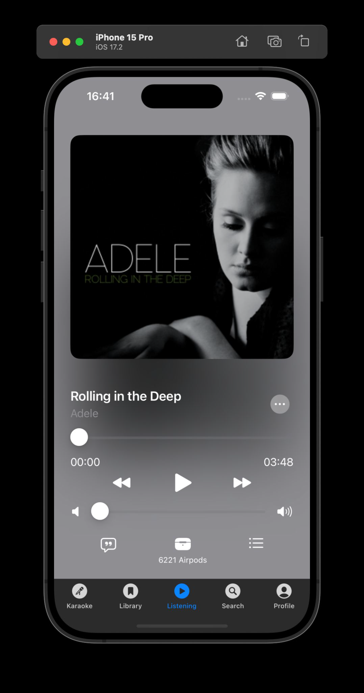
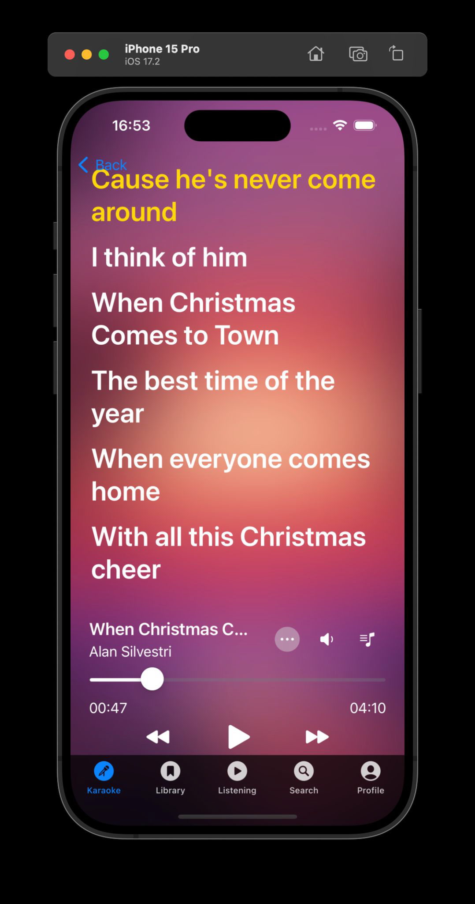
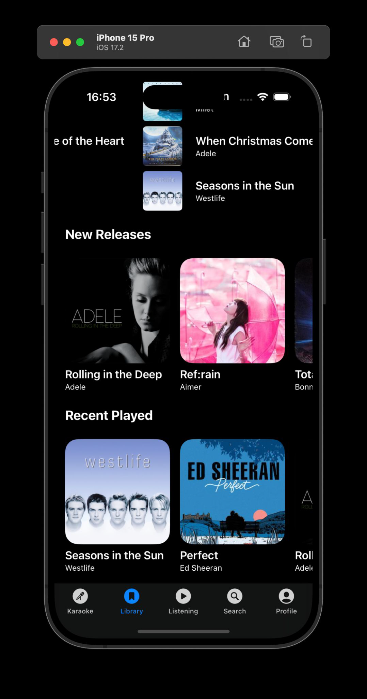
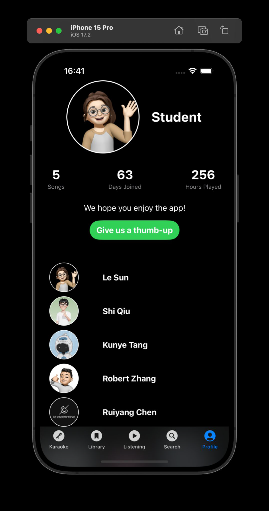

<a name="readme-top"></a>
[![Contributors][contributors-shield]][contributors-url]
[![Forks][forks-shield]][forks-url]
[![Stargazers][stars-shield]][stars-url]
[![Issues][issues-shield]][issues-url]
[![License: MIT][license-shield]][license-url]

<!-- PROJECT LOGO -->
<br />
<div align="center">
  

  <h3 align="center">SongSpark</h3>

  <p align="center">
    A Versatile iOS Music Player with Karaoke Functionality
    <br />
    <a href="https://github.com/CyberMeteor/GWU_CSCI6221_Swift/tree/main"><strong>Explore the docs »</strong></a>
    <br />
    <br />
    <a href="https://github.com/ryan0980/GWU_CSCI6221_Swift/tree/main/Demo/Demo.mp4">View Demo</a>
    ·
    <a href="https://github.com/CyberMeteor/GWU_CSCI6221_Swift/issues/new?labels=bug&template=bug-report---.md">Report Bug</a>
    ·
    <a href="https://github.com/CyberMeteor/GWU_CSCI6221_Swift/issues/new?labels=enhancement&template=feature-request---.md">Request Feature</a>
  </p>
</div>

<!-- TABLE OF CONTENTS -->
<details>
  <summary>Table of Contents</summary>
  <ol>
    <li>
      <a href="#about-the-project">About The Project</a>
      <ul>
        <li><a href="#built-with">Built With</a></li>
      </ul>
    </li>
    <li>
      <a href="#getting-started">Getting Started</a>
      <ul>
        <li><a href="#prerequisites">Prerequisites</a></li>
        <li><a href="#installation">Installation</a></li>
      </ul>
    </li>
    <li><a href="#usage">Usage</a></li>
    <li><a href="#contributing">Contributing</a></li>
    <li><a href="#license">License</a></li>
    <li><a href="#contact">Contact</a></li>
    <li><a href="#acknowledgments">Acknowledgments</a></li>
  </ol>
</details>

## About The Project

<div align="center">
  <a href="https://example.com">
    
  </a>
  <a href="https://example.com">
    
  </a>
  <a href="https://example.com">
    
  </a>
  <a href="https://example.com">
    
  </a>
</div>


SongSpark is a lightweight iOS music and karaoke player designed to offer a premium music experience. It allows users to sort songs, create playlists, search through their library, and enjoy karaoke with real-time lyrics scrolling.

### Built With

This project was built using:
* ![Swift][Swift-url]
* ![SwiftUI][SwiftUI-url]
* ![Xcode][Xcode-url]
* ![MusicbrainzMusicKit][MusicKit-url]

## Getting Started

To get a local copy up and running follow these simple steps.

### Prerequisites

This is an example of how to list things you need to use the software and how to install them.
* Xcode
  ```sh
  Install Xcode from the Mac App Store
  ```

### Installation

1. Clone the repo
   ```sh
   git clone https://github.com/CyberMeteor/GWU_CSCI6221_Swift/tree/main.git
   ```
2. Open the project in Xcode
   ```sh
   Open `SongSpark.xcodeproj` in Xcode
   ```
3. Run the application
   ```sh
   Select an iOS simulator and press Run
   ```

## Usage

Use SongSpark to play music, create and manage playlists, or enjoy a karaoke night with real-time lyrics display. It's great for music lovers and karaoke enthusiasts who value privacy and offline accessibility.

## Contributing

Contributions are what make the open source community such an amazing place to learn, inspire, and create. Any contributions you make are **greatly appreciated**.

## License

Distributed under the MIT License.

## Contact

Project Link: [https://github.com/CyberMeteor/GWU_CSCI6221_Swift/tree/main](https://github.com/CyberMeteor/GWU_CSCI6221_Swift/tree/main)


<!-- MARKDOWN LINKS & IMAGES -->
<!-- https://www.markdownguide.org/basic-syntax/#reference-style-links -->
[contributors-shield]: https://img.shields.io/github/contributors/CyberMeteor/GWU_CSCI6221_Swift.svg?style=for-the-badge
[contributors-url]: https://github.com/CyberMeteor/GWU_CSCI6221_Swift/graphs/contributors
[forks-shield]: https://img.shields.io/github/forks/CyberMeteor/GWU_CSCI6221_Swift.svg?style=for-the-badge
[forks-url]: https://github.com/CyberMeteor/GWU_CSCI6221_Swift/network/members
[stars-shield]: https://img.shields.io/github/stars/CyberMeteor/GWU_CSCI6221_Swift.svg?style=for-the-badge
[stars-url]: https://github.com/CyberMeteor/GWU_CSCI6221_Swift/stargazers
[issues-shield]: https://img.shields.io/github/issues/CyberMeteor/GWU_CSCI6221_Swift.svg?style=for-the-badge
[issues-url]: https://github.com/CyberMeteor/GWU_CSCI6221_Swift/issues
[license-shield]: https://img.shields.io/badge/License-MIT-yellow.svg?style=for-the-badge
[license-url]: https://opensource.org/licenses/MIT
[linkedin-shield]: https://img.shields.io/badge/-LinkedIn-black.svg?style=for-the-badge&logo=linkedin&colorB=555
[linkedin-url]: https://www.linkedin.com/in/shi1qiu
[product-screenshot]: images/screenshot.png
[Swift-url]: https://img.shields.io/badge/Swift-F54A2A?style=for-the-badge&logo=swift&logoColor=white
[SwiftUI-url]: https://img.shields.io/badge/SwiftUI-0D101E?style=for-the-badge&logo=swift&logoColor=white
[Xcode-url]: https://img.shields.io/badge/Xcode-147EFB?style=for-the-badge&logo=xcode&logoColor=white
[MusicKit-url]: https://img.shields.io/badge/MusicKit-000000?style=for-the-badge&logo=apple&logoColor=white
